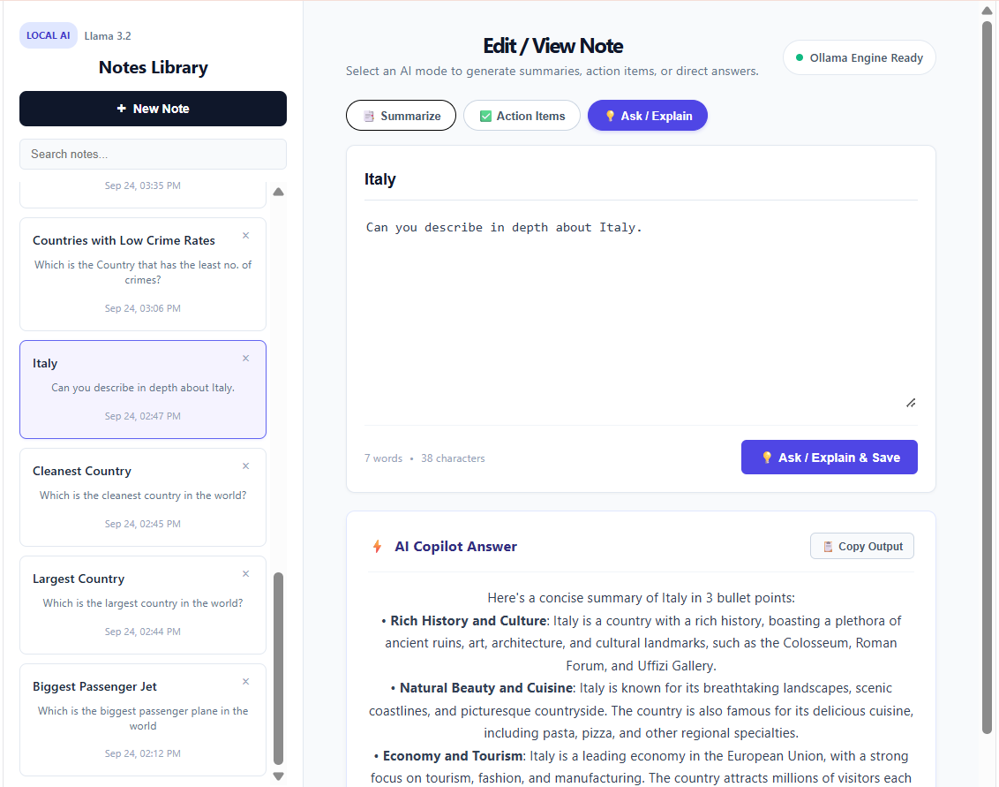

# SmartNotes – Full-Stack AI Workspace

SmartNotes is an end-to-end, privacy-focused note-taking application powered by **.NET 10 Web API**, **React**, and on-device AI inference utilizing **Llama 3.2** via **Ollama**. 

Unlike conventional AI tools that transmit sensitive information to external cloud APIs, SmartNotes processes all text analysis, summarization, and action-item generation directly on your local machine.

---

## 📸 Application Preview



---

## 🚀 Key Features

* **Local & Private AI Processing:** 100% on-device inference using Llama 3.2 with zero third-party latency, zero token costs, and complete data privacy.
* **Versatile AI Assistance Modes:**
  * **📑 Summarize:** Condenses lengthy meetings or rough notes into concise executive takeaways.
  * **✅ Action Items:** Parses free-form text into an itemized, executable checklist.
  * **💡 Ask / Explain:** Explains concepts, clarifies complex thoughts from your text, and stores the explanation directly with your note.
* **Persistent Storage:** Full relational CRUD support backed by Entity Framework Core and SQL Server LocalDB.
* **Streamlined UI/UX:**
  * Live search and filtering across saved notes.
  * One-click clipboard copy utility with timed visual feedback.
  * Clean dual-pane workspace layout.

---

## 🏗️ Application Architecture

SmartNotes utilizes a multi-tier decoupled architecture:

```text
[ Browser / React Client ]
           │  (HTTP / JSON)
           ▼
[ ASP.NET Core Web API (.NET 10) ]
      │                     │
      │ (EF Core)           │ (HTTP Client)
      ▼                     ▼
[ SQL Server LocalDB ]   [ Local Ollama Engine (Llama 3.2) ]
```

* **Client Layer (React / Vite):** Handles UI rendering, input capture, mode toggling, and asynchronous HTTP calls to the backend.
* **Service / API Layer (.NET 10):** Orchestrates business logic, manages CORS, handles database transactions, and communicates with the local LLM.
* **AI Engine (Ollama):** Serves the quantized Llama 3.2 model over local port `11434` without outbound network access.
* **Data Persistence Layer:** Stores and indexes notes, summaries, and creation timestamps via Entity Framework Core.

---

## 🔄 Operations & AI Workflows

1. **Note Creation & Editing:** Users input raw text or meeting transcripts into the editor.
2. **AI Mode Selection:** Users choose between **Summarize**, **Action Items**, or **Ask / Explain**.
3. **Inference Pipeline:**
   * React passes note content and selected mode to `POST /api/ai/process`.
   * The .NET 10 backend crafts a tailored prompt matching the mode and invokes Ollama's local endpoint.
   * The sanitized response returns to the client UI.
4. **Persistence:** The client saves the note alongside its AI output to SQL Server via `POST /api/notes`.

---

## 📂 Project Structure

```text
SmartNotes/
│
├── images/
│   └── smartnotes.png            # Application preview image
│
├── SmartNotesApi.slnx            # Solution definition
│
├── SmartNotesApi/                # Backend (.NET 10 Web API)
│   ├── Controllers/
│   │   ├── AiController.cs       # Ollama integration & AI prompting
│   │   └── NotesController.cs    # Relational CRUD endpoints
│   ├── Data/
│   │   └── NotesDbContext.cs     # EF Core database context
│   ├── DTOs/
│   │   └── AiDtos.cs             # Strongly-typed API request/response models
│   ├── Models/
│   │   ├── Note.cs               # Domain entity model
│   │   └── SummarizeResponse.cs  # Ollama payload contract
│   ├── appsettings.Development.json          # Database connection strings & settings
│   └── Program.cs                # Dependency injection & pipeline config
│
└── smartnotes-ui/                # Frontend (React + Vite)
    ├── src/
    │   ├── services/
    │   │   └── aiService.js      # Backend API communication layer
    │   ├── App.jsx               # Primary application UI & logic
    │   ├── main.jsx              # React DOM mounting
    │   └── App.css               # Component & layout styles
    ├── package.json              # Client dependencies & scripts
    └── vite.config.js            # Vite build configuration
```

---

## 🔌 API Endpoints

### 1. Notes Management (`/api/notes`)

| Method | Endpoint | Description |
| :--- | :--- | :--- |
| `GET` | `/api/notes` | Retrieves all saved notes ordered by timestamp. |
| `POST` | `/api/notes` | Creates and persists a new note with AI summary/explanation. |
| `PUT` | `/api/notes/{id}` | Updates existing note title, body, or AI output. |
| `DELETE` | `/api/notes/{id}` | Removes a note from the database. |

### 2. AI Intelligence (`/api/ai`)

| Method | Endpoint | Description |
| :--- | :--- | :--- |
| `POST` | `/api/ai/process` | Sends note text and mode (`summarize`, `action-items`, or `explain`) to Llama 3.2 via Ollama and returns generated output. |

---

## 🧠 Key Learning Areas

* **On-Premise LLM Integration:** Communicating with local Ollama daemons from C# using `HttpClient` and structured JSON serialization.
* **Modern .NET 10 Patterns:** Utilizing minimal setups, typed DTO records, and dependency injection in ASP.NET Core.
* **Entity Framework Core ORM:** Configuring database contexts, migrations, and asynchronous CRUD operations.
* **Modern React State Management:** Managing asynchronous lifecycle hooks (`useEffect`), component state (`useState`), and dynamic UI mode switching.
* **CORS & Secure Local APIs:** Safely routing cross-origin requests between Vite dev servers (`localhost:5173`) and ASP.NET Core API endpoints.

---

## ⚙️ Getting Started

### 1. Prerequisites
* [.NET 10 SDK](https://dotnet.microsoft.com/)
* [Node.js](https://nodejs.org/) (v18+)
* [Ollama](https://ollama.com/) with Llama 3.2 installed:
  ```bash
  ollama run llama3.2
  ```

### 2. Run the Backend API
```bash
cd SmartNotesApi
dotnet run
```

### 3. Run the Frontend Client
```bash
cd smartnotes-ui
npm install
npm run dev
```

---

## 👨‍💻 Author

**Praveen Puthran**
* GitHub: [@Praveen98592](https://github.com/Praveen98592)
* LinkedIn: [Praveen Puthran](https://www.linkedin.com/in/praveen-puthran)